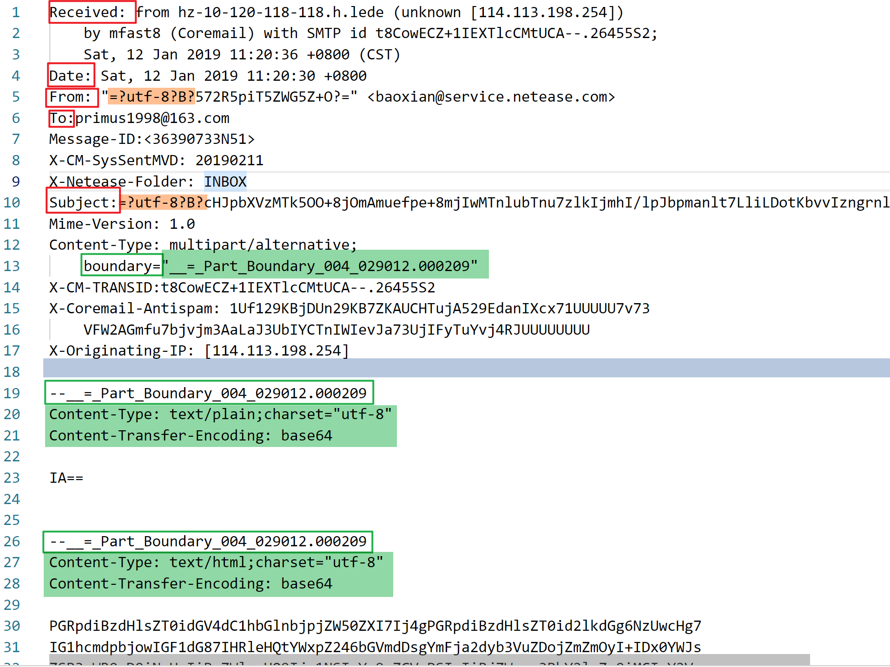

# Computer-Network-Course-Project

## Overview

- [Weekly overview - 9][#w9]
- [Weekly overview - 8](#w8)
- [Weekly overview - 7](#w7)
- [Weekly overview - 6](#w6)
- [Weekly overview - 5](#w5)
- [Weekly overview - 4](#w4)
- [Weekly overview - 3](#w3)
- [Weekly overview - 2](#w2)
- [Notes](#notes)

## W9

### Current features

- Login with account and password, automatically detect and choose the host and port
- Alternatively apply SMTP, POP3, IMAP protocol when login
- Mail overview with valid mail content parts based on MIME protocol
- Attachments download, allowing alternative download path and filename
- Dynamic display of mail information
- Cache management
- Documents
- GUI packaging

## W8

### Current features

- Login with account and password, automatically detect and choose the host and port
- Mail overview with valid mail content parts based on MIME protocol
- Attachments download, allowing alternative download path and filename
- Dynamic display of mail information
- Cache management

### Potential future features

- Error tolerance and reminding
- GUI packaging
- Documents

[return](#overview)

## W7

### Current features

- Login with account and password, automatically detect and choose the host and port
- Mail overview with valid mail content parts based on MIME protocol
- Dynamic display of mail information

### Potential future features

- Attachments identification and download
- Optimized cache management

### Faced problems

- Data exchange of JavaScript File object from server to client
- Privacy preserving in cache

[return](#overview)

## W6

### Current features

- Login with account and password, automatically detect and choose the host and port
- Mail overview with valid mail content parts based on MIME protocol
- Dynamic display of mail information

### Potential future features

- Attachments identification and download
- Optimized cache management
- Prettify website appearance

### Faced problems

- Data exchange of JavaScript File object from server to client
- Privacy preserving in cache

[return](#overview)

## W5

### **Big change!**

Because of the Tkinter components do not support standard UTF-16 charsets, the GUI should not support display of Chinese characters. As this is the case of the GUI and the backend is not effected, further investigation of better GUI support, and also the whole project design is on the way.

**Thanks to advice of my roommate, I am trying to shift the project into the B/S architecture based on web development. I choose the frontend frame Vue-CLI and backend support Flask to rebuild my projects.**

### Current features

- Part of login and mail retrieving functions on the backend
- Basic frame of client and server

### Future features

- Integration of previous login and mail retrieving codes with new Flask server
- Build basic website structure based on Vue-CLI application
- Build and optimization of communication between client and server based on HTTP protocol

[return](#overview)

## W4

### **Big change!**

**Because of the Tkinter components do not support standard UTF-16 charsets, the GUI should not support display of Chinese characters. As this is the case of the GUI and the backend is not effected, further investigation of better GUI support, and also the whole project design is on the way.**

### Current features

- Part of login and mail retrieving functions on the backend

### Faced problems

- Primary part of the current project does not support necessary mail contents

[return](#overview)

## W3

### 目前已完成的进度

- 完成了确定选题、初步构思

  - 用Python搭建实现以下功能的GUI：

    - [x] **GUI界面搭建(Tkinter)**
    - [ ] 登陆常用邮箱(poplib, temp)
      - [x] 163
      - [ ] QQ
      - [ ] outlook
      - [ ] mails.tsinghua
      - [ ] sem.tsinghua
    - [x] 收取和查看已有邮件(re, base64, quoari)
      - [x] 所有时间
      - [x] **支持刷新**
      - [x] **根据需要加载**
    - [ ] **支持查看的内容格式(Content-type)**
      - [ ] **text/html**
      - [ ] **text/plain**
      - [ ] **Others**
    - [ ] 删除邮件
    - [ ] 回复/发送邮件
    - [x] 退出邮箱

### 未来一周要完成的任务

- 完成删除邮件
- 完善GUI
- 实现Tkinter对邮件内容的显示支持

[return](#overview)

## W2

### 目前已完成的进度

- 完成了确定选题、初步构思

  - 用Python搭建实现以下功能的GUI：

    - [ ] GUI界面搭建(Tkinter)
    - [ ] 登陆常用邮箱(poplib, temp)
      - [x] 163
      - [ ] QQ
      - [ ] outlook
      - [ ] mails.tsinghua
      - [ ] sem.tsinghua

    - [x] 收取和查看已有邮件(re, base64, quoari)
      - [x] 所有时间
      - [ ] 支持刷新
      - [ ] 根据需要加载
    - [ ] 删除邮件
    - [ ] 回复/发送邮件
    - [ ] 退出邮箱

### 未来一周要完成的任务

- 完成收取和查看已有邮件
- 完成删除邮件
- 完成GUI的初步搭建

[return](#overview)

## Notes

#### MIME 协议

- 常见格式为：
  - 
  - 其中：
    - 标红框的是基本结构，包括邮件的Send address, Date, From, To,  Subject等
    - 表绿色框的是MIME协议下分隔各个邮件数据的标识符boundary
    - 表淡蓝色框的是分隔邮件头和邮件体的空行
    - 表橙色框的是表示邮件该部分内容的数据为utf-8字符集(charset)、Base64编码(encoding)的格式，图中第二个橙色框的数据解码为“网易商城”
- 关于Document-Type
  - 常见格式包括
    - multipart/mixed: used in mail head
    - multipart/alternative: used in mail head
    - text/html: html
    - text/plain: plain text
- 关于字符集和编码
  - 字符集
    - byte
    - UTF-8
  - 编码
    - B: base64
    - Q: quoted-printable
    - 7bit or 8bit: not found yet

#### 处理MIME协议格式的初步设想

- 获得邮件初始信息
- capture信件基本信息
  - 包括
    - from
    - to
    - date
    - cc
    - boundary
- 根据boundary获取信件内容
- 根据charset, content-transfer-encoding正确编译数据
- 根据content-type显示不同内容

##### 难点

- 回信的识别和处理
- 附件的识别和处理

##### Tkinter

wedgets

- How Listbox and Other wedgets link
  - Listbox.curselection() 
    - returns the index of chosen items preset in the listbox object
- How to present MIME context in Tkinter GUI
- How to refresh mailbox

[return](#overview)